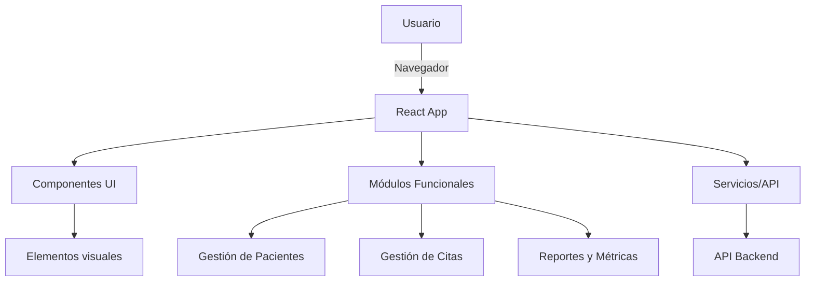

  
   
   
  
  
  
  
  
  
  
 

  

 
# ReflexoPeru-V2-Front

Bienvenido al frontend de ReflexoPeru, una plataforma moderna para la gestión integral de clínicas de reflexología. Este proyecto está desarrollado en React + Vite y sigue una arquitectura modular, escalable y profesional.

## Descripción General

ReflexoPeru-V2-Front permite administrar pacientes, citas, reportes, personal y pagos, facilitando la operación diaria y la toma de decisiones mediante reportes y métricas visuales. El sistema está orientado a personal administrativo y terapeutas, brindando una experiencia de usuario ágil y eficiente.

## Tecnologías principales
- React
- Vite
- Ant Design
- ApexCharts
- Axios
- React Router

## Estructura del Proyecto

- **src/components/**: Componentes reutilizables (botones, inputs, tablas, modales, etc.)
- **src/features/**: Módulos funcionales (pacientes, citas, reportes, etc.)
- **src/pages/**: Páginas principales de la app
- **src/routes/**: Rutas y protección de rutas
- **src/services/**: Servicios de API y notificaciones
- **src/utils/**: Utilidades generales
- **src/assets/**: Imágenes y fuentes

## Arquitectura

## Tabla de Navegación

| Sección                  | Descripción breve                                 | Enlace                         |
|--------------------------|---------------------------------------------------|---------------------------------|
| Componentes              | Componentes reutilizables y su uso                | [Ver más](./docs/components.md)           |
| Hooks                    | Hooks personalizados y ejemplos                   | [Ver más](./docs/hooks.md)                |
| Servicios                | Servicios de API, notificaciones y utilidades     | [Ver más](./docs/services.md)             |
| Rutas                    | Navegación y protección de vistas                 | [Ver más](./docs/routes.md)               |
| Estilos                  | Organización y buenas prácticas de CSS            | [Ver más](./docs/styles.md)               |
| Arquitectura             | Diagrama y explicación del flujo general          | [Ver más](./docs/arquitectura.md)         |

Para más detalles, consulta la documentación completa en la carpeta [`/docs`](./docs).

---

¿Tienes dudas o sugerencias? Revisa la sección de [FAQ](./docs/faq.md) o abre un issue en el repositorio.
