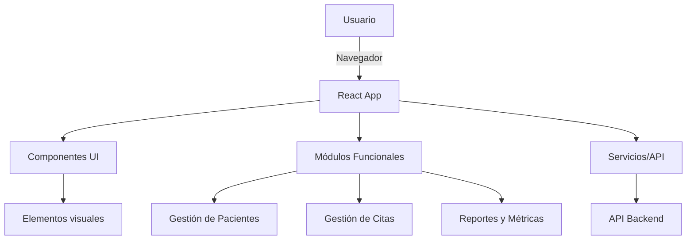

  
   
  

# Arquitectura

La arquitectura de ReflexoPeru-V2-Front está basada en una estructura modular y desacoplada, facilitando la escalabilidad y el mantenimiento.

## Diagrama de Arquitectura

## Explicación
- **Componentes**: Elementos reutilizables de la interfaz.
- **Features**: Módulos funcionales independientes (pacientes, citas, reportes, etc.).
- **Servicios**: Encapsulan la lógica de comunicación con APIs y servicios externos.
- **Backend**: Provee los datos y lógica de negocio a través de una API REST. 